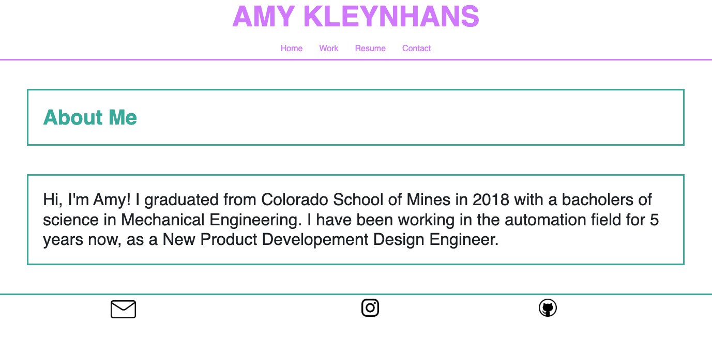
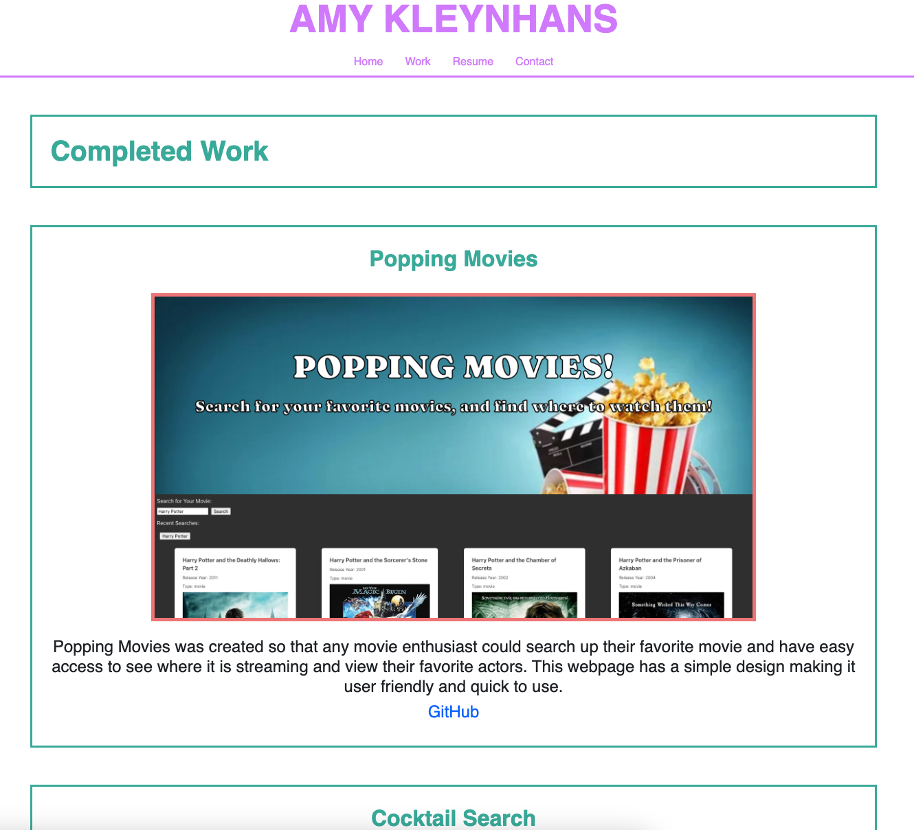
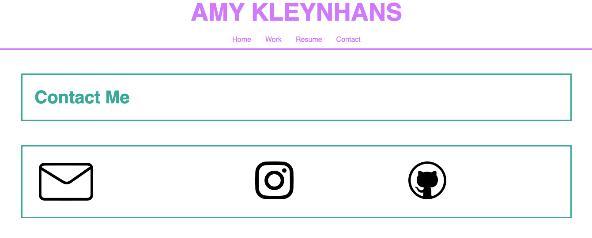
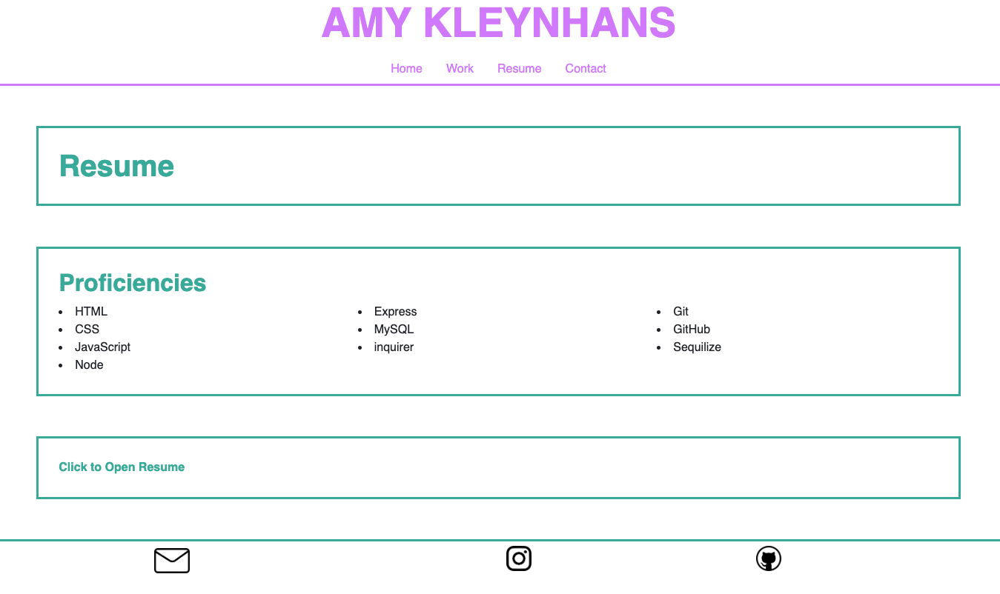

# ReactPortfolio

## Description

This app builds a site to display my portfolio and completed works for future employers or career oppertunitties. The user can navigate through this site and look at the projects as well as deploy the sites and redirect to the github code. This app also features my resume, an about me section, and links to contact me.

## Installation

N/A

## Usage

[link to deployed app](https://656a59c978668a46e17fd4e5--capable-frangollo-7a13d0.netlify.app)

 
Deployed app showing the home page. 

 
Deployed app showing my completed projects page. 

 
Deployed app showing the contact page. 

 
Deployed app showing the resume page. 

## Credits

[link to react tutorial](https://legacy.reactjs.org/tutorial/tutorial.html) 
[link to hover tutorial](https://travis.media/how-to-make-an-item-grow-on-hover-with-css/) 
[link to css column tutoria](https://www.w3schools.com/howto/howto_css_three_columns.asp)